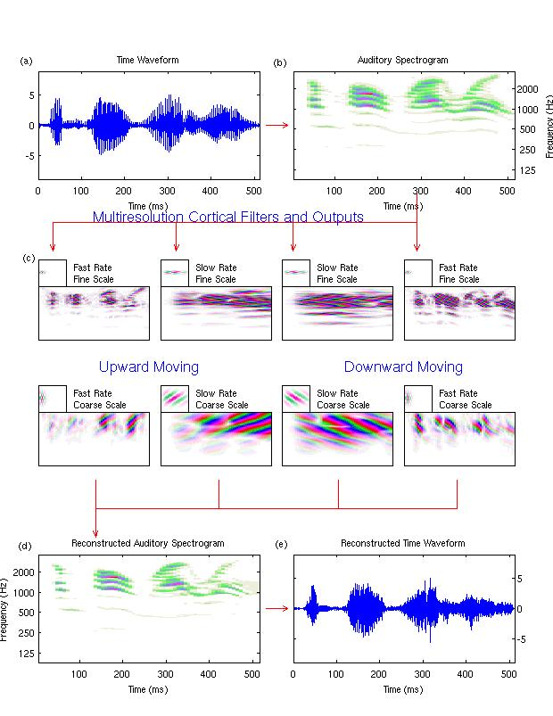

# nsltools 

This code is mirrored/forked from [UMD's nsltools](http://nsl.isr.umd.edu/downloads.html)

Working in Matlab R2007b.



## Demo plot

```
x = auread('_come.au'); % this file is 8kHz, x = decimate(x, 2); is not neccessary
xh = schematc(x); 
```

### Demo in pieces

Should be run after `xh = schematc(x);`.

```
x = auread('_come.au');

paras(1)=8;
paras(2)=8;
paras(3)=-2;
paras(4)=-1;

y = wav2aud(x, paras);

rv = 2.^(2:5);
sv = 2.^(-2:3);
fcorname = '_come.cor';

z = aud2cor(y, paras, rv, sv, fcorname);

yh = cor2aud(fcorname);

xh = aud2wav(yh, [], [paras 10 0 1]);
```

#### Saved for posterity

Included in this repo are a saved `.mat` files that can be loaded in python to check that behavior is replicated correctly.

```
save('x_audio_8kHz.mat', 'x')
save('y_audspec_8kHz.mat', 'y')
save('z_cort_8kHz.mat', 'z')
save('yh_rec_audspec_8kHz.mat', 'yh')
save('xh_rec_audio_8kHz.mat', 'xh')
```

```
save('Y_audspec_fft_8kHz.mat', 'Y')
save(['z1_TD_rdx_' rdx '_sgn_' sgn '.mat'], 'z1')
save(['HR_FD_rdx_' int2str(rdx) '_sgn_' int2str(sgn) '.mat'], 'HR')
save(['HS_FD_rdx_' int2str(sdx) '.mat'], 'HS')

save('Z-cum_inverse_8kHz.mat', 'Z_cum')
save('HH-cum_inverse_8kHz.mat', 'HH')

save('Z-cum0_inverse_8kHz.mat', 'Z_cum')
save('HH-cum0_inverse_8kHz.mat', 'HH')

save('Z_whatisit_8kHz.mat', 'Z')
save('R1_whatisit_8kHz.mat', 'R1')
```
